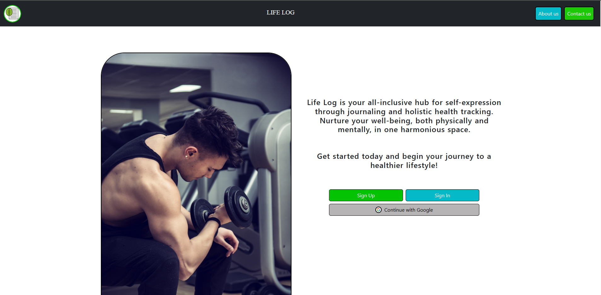

# Life Log Website

Welcome to Life Log – your personal well-being platform built using Angular and MongoDB.



## About

Life Log is an all-inclusive platform that seamlessly blends the art of self-expression through journaling with the science of holistic health tracking. It offers you a harmonious space to reflect, grow, and nurture your physical, emotional, and mental wellness.

## Features

- **Journaling:** Express yourself through the power of journaling. Write down your thoughts, ideas, and experiences in a safe and private space.

- **Health Tracking:** Monitor your well-being journey by tracking your physical, emotional, and mental health. Set goals and track your progress.

- **User-Friendly Interface:** Life Log provides an intuitive and user-friendly interface designed to make your experience enjoyable and meaningful.

## Getting Started

Link to demo site: (coming soon)

To run the Life Log website locally, follow these steps:

1. Clone the repository:

```sh
git clone https://github.com/your-username/life-log.git

npm install -g @angular/cli

ng serve
